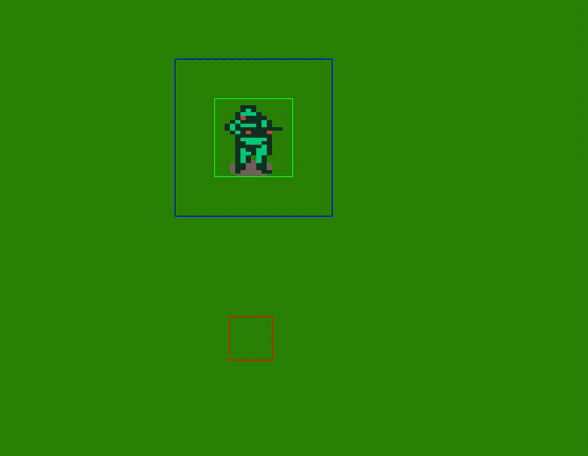

# compilar programa C++ con SDL2



`g++ -o game main.cpp Classes/* -I ../SDL2/include -L ../SDL2/lib -lmingw32 -lSDL2main -lSDL2_image -lSDL2_ttf -lSDL2`

```
g++ -o game main.cpp Classes/* -I ../SDL2/include -L ../SDL2/lib -lmingw32 -lSDL2main -lSDL2_image -lSDL2_ttf -lSDL2

# g++                   compilador C++
# -o game               nombre del archivo de salida
# main.cpp Classes/*    codigo fuente a compilar
# -I SDL2/include       llamada al compilador g++ con la opcion -I para especificar la ubicacion de los headers
# -L SDL2/lib           indicar la ubicacion de las bibliotecas SDL2
# -lmingw32             biblioteca para interoperabilidad entre Windows y MinGW
# -lSDL2main            biblioteca necesaria para compilar programas SDL2 en Windows
# -lSDL2_image          biblioteca necesaria para trabajar con imagenes en SDL2
# -lSDL2_ttf            biblioteca necesaria para trabjar con fuentes en SDL2
# -lSDL2                biblioteca principal de SDL2
```